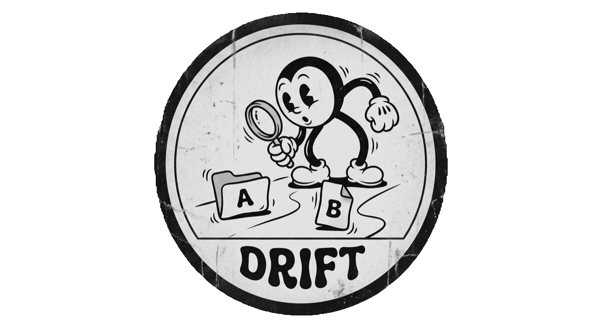

# drift

<p align="center">
  
</p>

A **fast**, **interactive** file **comparison tool**.

Compare directories, archives, binaries, plists, text files, and git commits with a terminal UI or structured JSON output.

[](https://asciinema.org/a/858111)

## Installation

[**Download a pre-built binary**](https://github.com/block/drift/releases) for your platform from a release.

---

### Alternative install methods

Use `go` to install a version:

```sh
go install github.com/block/drift/cmd/drift@latest # or @vX.X.X
```

Or build from source:

```sh
gh repo clone block/drift
cd drift
go run ./cmd/drift --help
```

## Usage

```sh
# Compare two directories
drift MyApp-v1.0 MyApp-v2.0

# Compare two archives (.ipa, .apk, .aar, .jar, .tar.gz, .tar.bz2)
drift MyApp-v1.0.ipa MyApp-v2.0.ipa

# Compare two binaries
drift MyApp-v1.0/MyApp.app/MyApp MyApp-v2.0/MyApp.app/MyApp

# Force a specific comparison mode
drift -m binary MyApp-v1.0/MyApp.app/libcore.dylib MyApp-v2.0/MyApp.app/libcore.dylib

# JSON output (non-interactive, for scripting)
drift --json MyApp-v1.0 MyApp-v2.0
```

### Git mode

drift can compare git commits, branches, and working tree changes - bringing its interactive TUI to your git workflow.

```sh
# View uncommitted changes (staged + unstaged + untracked)
drift

# Compare a ref against HEAD
drift HEAD~3
drift main

# Compare any two refs (commits, branches, tags)
drift main feature-branch
drift v1.0.0 v2.0.0

# Target a different repo with -C
drift -C ~/projects/my-app HEAD~1 HEAD

# Force git mode when a ref collides with a file path
drift --git main feature
```

When comparing git refs, the root node in the tree shows commit metadata including SHA, author, date, and links to the commit and pull request on GitHub.

Auto-detection resolves arguments as git refs when they don't match filesystem paths. Use `--git` to skip path detection entirely.

## Agent skill

drift ships a skill that gives AI coding agents native access to structured file comparison via `drift --json`. The skill is included in every [GitHub release](https://github.com/block/drift/releases).

Install with a single command:

**Claude Code**

```sh
mkdir -p ~/.claude/skills/drift && gh release download --repo block/drift --pattern 'skill.tar.gz' --output - | tar -xz -C ~/.claude/skills/drift
```

**Codex / Amp**

```sh
mkdir -p ~/.agents/skills/drift && gh release download --repo block/drift --pattern 'skill.tar.gz' --output - | tar -xz -C ~/.agents/skills/drift
```

**Agent skill demo**

[](https://asciinema.org/a/858411)

### Comparison modes

drift auto-detects the comparison mode based on the inputs:

| Mode | Inputs | What it shows |
|------|--------|---------------|
| **git** | Commits, branches, tags | File tree of changes between refs with commit metadata and per-file diffs |
| **tree** | Directories, archives | File tree with added/removed/modified indicators, per-file diffs |
| **binary** | Mach-O binaries | Sections, sizes, symbols, load commands. Requires `nm` and `size` |
| **plist** | Property lists (.plist) | Structured key-value diff. Binary plists require `plutil` |
| **text** | Everything else | Line-by-line unified diff |

Use `-m <mode>` to override auto-detection.

### Archives

drift transparently extracts and compares the contents of:
- `.ipa` (iOS app bundles)
- `.apk` (Android app bundles)
- `.aar` (Android libraries)
- `.jar` (Java archives)
- `.tar`, `.tar.gz` / `.tgz`, `.tar.bz2`

## Interactive TUI

When stdout is a terminal, drift launches an interactive Bubbletea-based TUI with a split-pane layout: file tree on the left, detail diff on the right.

### Keybindings

| Key | Action |
|-----|--------|
| `↑`/`k`, `↓`/`j` | Navigate tree |
| `→`/`enter`/`l` | Expand node |
| `←`/`h` | Collapse node |
| `tab` | Switch pane focus |
| `n`/`N` | Next/previous change |
| `f` | Cycle filter (all → added → removed → modified) |
| `1`-`4` | Filter: all, added, removed, modified |
| `/` | Search (fuzzy match in tree, text search in detail) |
| `s` | Swap A ↔ B |
| `c` | Copy detail to clipboard |
| `pgup`/`pgdn` | Scroll detail pane |
| `g`/`G` | Jump to top/bottom |
| `?` | Toggle full help |
| `q`/`ctrl+c` | Quit |

## JSON output

Pass `--json` to get structured, machine-readable JSON output - ideal for CI pipelines, automation scripts, and AI-powered analysis.

```sh
drift --json MyApp-v1.0 MyApp-v2.0
drift --json MyApp-v1.0/MyApp.app/libcore.dylib MyApp-v2.0/MyApp.app/libcore.dylib
drift --json MyApp-v1.0.ipa MyApp-v2.0.ipa | jq '.summary'
```

### Output structure

Every JSON result includes:

| Field | Description |
|-------|-------------|
| `path_a`, `path_b` | The compared paths |
| `mode` | Detected comparison mode (`git`, `tree`, `binary`, `plist`, `text`) |
| `root` | The diff tree - each node has `name`, `path`, `status`, `kind`, `size_a`, `size_b`, and optional `children` |
| `summary` | Aggregate counts: `added`, `removed`, `modified`, `unchanged`, `size_delta` |

Node `status` is one of: `unchanged`, `added`, `removed`, `modified`.

For single-file modes (binary, plist, text), a `detail` field is automatically included with mode-specific data:

- **binary** - `symbols` (added/removed symbol names) and `sections` (segment/section size changes)
- **plist** - `changes` with `key_path`, `status`, and before/after values
- **text** - `hunks` with line-level diffs (`kind`: `context`, `added`, `removed`)

### Examples

Detect new files added between two builds:

```sh
drift --json MyApp-v1.0 MyApp-v2.0 | jq '[.root | .. | select(.status? == "added") | .path]'
```

Get the total size delta:

```sh
drift --json MyApp-v1.0 MyApp-v2.0 | jq '.summary.size_delta'
```

List changed symbols in a binary:

```sh
drift --json MyApp-v1.0/MyApp.app/libcore.dylib MyApp-v2.0/MyApp.app/libcore.dylib \
  | jq '.detail.binary.symbols[] | select(.status == "added") | .name'
```

Feed a comparison to an LLM for analysis:

```sh
drift --json MyApp-v1.0.ipa MyApp-v2.0.ipa | llm "Summarize what changed between these two builds"
```

## Platform support

drift works on **macOS**, **Linux**, and **Windows**. Core features (directory/archive comparison, text diffing) work everywhere. Some features require external tools and degrade gracefully when they are unavailable:

| Tool | Used for | Availability |
| --- | --- | --- |
| `git` | Git mode (commit/branch/worktree comparison) | All platforms |
| `nm`, `size` | Mach-O binary analysis | macOS (Xcode CLI Tools), Linux (binutils) |
| `plutil` | Binary plist conversion | macOS only (XML plists work everywhere) |
| `xclip` or `xsel` | Clipboard | Linux only (macOS and Windows work natively) |

## License

[Apache License 2.0](LICENSE)
